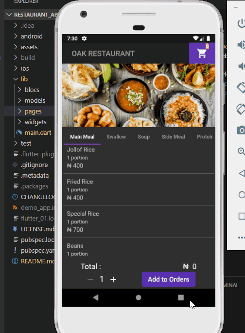

# Restaurant_app

## Mobile app built using Flutter. 

### Wide application of Static typing, BLoC pattern and Flutter Streams. 

* This is a demo restaurant app designed using BLoC pattern architecture and reactive programming for state management. It enjoys a flexibility of use and is easily maintainable and scalable. 

* Please fork and make changes, where you deem necessary.

* See a gif of the app in action.

